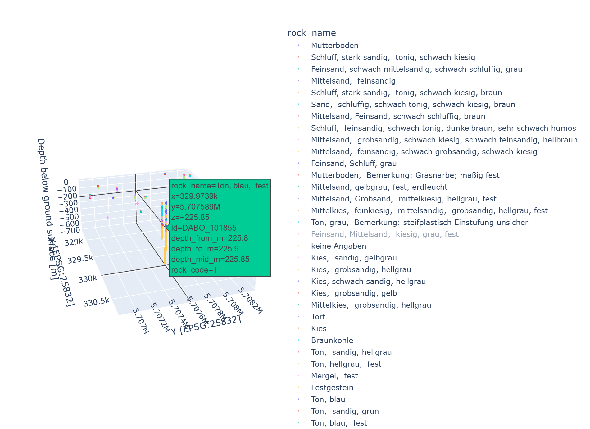

# NRW Borehole WFS 3D Stratigraphy Viewer

Python workflow to retrieve borehole and stratigraphy data from the public NRW borehole database and visualise the subsurface layers in 3D.

Data source: https://www.bohrungen.nrw.de/

## Overview

This project retrieves borehole information for a user-defined area of interest. The area can be provided either as:

- a WKT polygon, usually in longitude/latitude coordinates (`EPSG:4326`), or
- a shapefile/vector file path, for example an existing AOI shapefile.

The selected area is converted to a bounding box in `EPSG:25832`, which is then used to query the NRW BoreholeML/WFS service.

The script downloads borehole header information and extracts the associated stratigraphic/lithological layers for each borehole. These layers are processed into a structured geospatial dataset with borehole identifiers, coordinates, depth intervals, mid-depth values, lithological codes, and lithological descriptions.

Optionally, the stratigraphy can be discretised into regular depth intervals, for example 10 cm layers, allowing the borehole information to be visualised in three dimensions using Plotly.

## Repository structure

```text
borehole-wfs-3d/
│
├── borehole_3d.py              # main command-line script
├── requirements.txt            # Python dependencies
├── README.md                   # project documentation
│
└── utils/             # reusable helper functions
    ├── __init__.py
    ├── geometry.py             # WKT/shapefile/BBOX and geometry conversion helpers
    ├── wfs.py                  # WFS requests and BoreholeML parsing
    ├── processing.py           # depth-grid expansion and GeoDataFrame creation
    └── plotting.py             # Plotly 3D visualisation
```

## Main features

- Query borehole data from the NRW public borehole database
- Define the search area using either a WKT polygon or a shapefile/vector file path
- Retrieve borehole header and stratigraphy information
- Extract lithological descriptions and depth intervals
- Generate regular 10 cm subsurface layers
- Export processed data as geospatial files
- Create an interactive 3D visualisation of borehole stratigraphy

## Installation

```bash
python -m venv .venv
.venv\Scripts\activate
pip install -r requirements.txt
```

## Example usage with WKT

```bash
python borehole_3d.py ^
  --wkt "POLYGON ((7.210851 51.486534, 7.217041 51.486534, 7.217041 51.488618, 7.210851 51.488618, 7.210851 51.486534))" ^
  --step 0.1 ^
  --color-column rock_name ^
  --output-gpkg borehole_layers_3d.gpkg ^
  --output-html boreholes_3d.html

## Example usage with shapefile

```bash
python borehole_3d.py ^
  --shapefile-path "aoi.shp" ^
  --step 0.1 ^
  --color-column rock_name ^
  --output-gpkg borehole_layers_3d.gpkg ^
  --output-html boreholes_3d.html
```

The shapefile must have a valid coordinate reference system. If the shapefile is not already in `EPSG:25832`, it will be reprojected automatically.

## Outputs

- `borehole_headers.gml`: raw downloaded borehole header features
- `borehole_layers_3d.gpkg`: processed fixed-depth borehole layer points
- `boreholes_3d.html`: interactive 3D Plotly visualisation
  
<p align="center">
  
</p>

## Important note

The current WFS query uses the **bounding box** of the WKT polygon or shapefile, not an exact polygon intersection. For rectangular AOIs this is usually equivalent. For irregular AOIs, you may want to clip or filter the downloaded points afterwards.

## Data source

The workflow accesses NRW BoreholeML/WFS services related to the public borehole portal:

- https://www.bohrungen.nrw.de/

